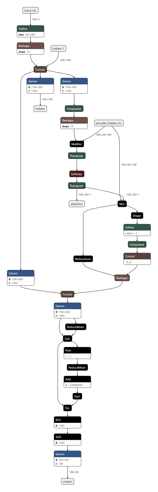
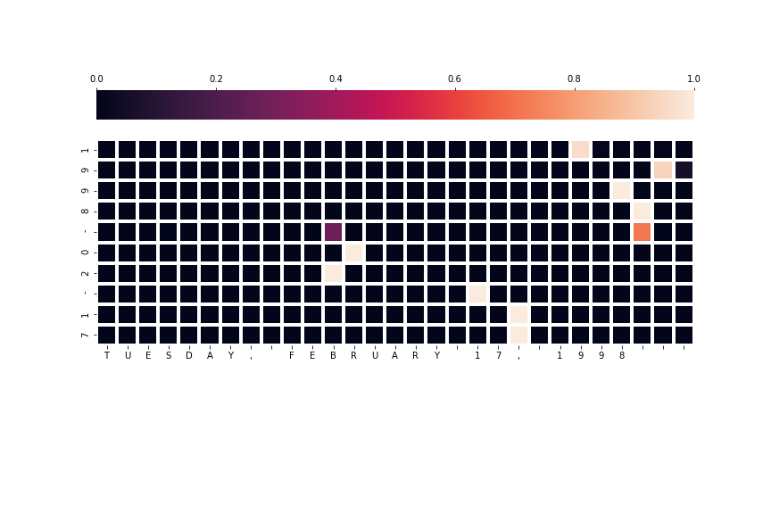
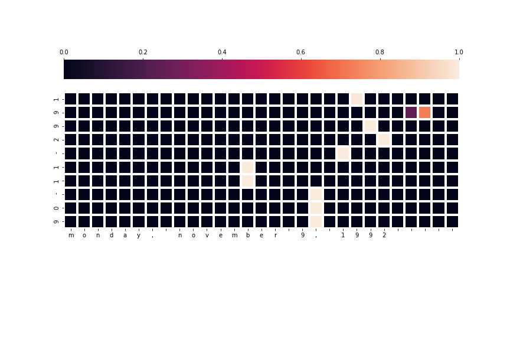

### Modelの解釈
**Encoder layer**  
手法: 単語埋め込み/LSTM  
目的:  
>入力データの時系列に従った各トークンの隠れ層を出力する  
>時系列の一番最後に出力される隠れ層を得る   
  

**Decoder layer**  
手法: 単語埋め込み/アテンション層  
目的:  
> 入力データはデコーダー層における１トークンずつ  
> １トークンの隠れ層とエンコーダー層の全ての隠れ層の行列積の計算による各トークンごとの重みづけ  
>  アテンション重みから計算される文脈ベクトルの生成  
> 次のトークンの隠れ層(Encoder hidden + Decoder input 1 token)を反映したもの  
  

### AttentionによるXAI  
学習時におけるエンコーダーとデコーダー層の各トークンの関係性を可視化したもの  
各重み和はソフトマックス関数により合計値が１になる
  
  
  
